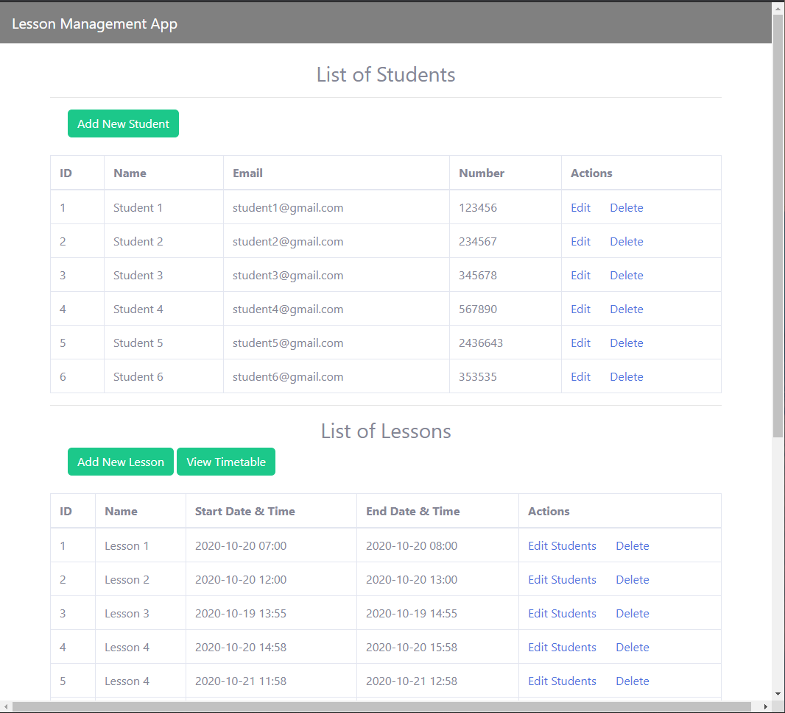
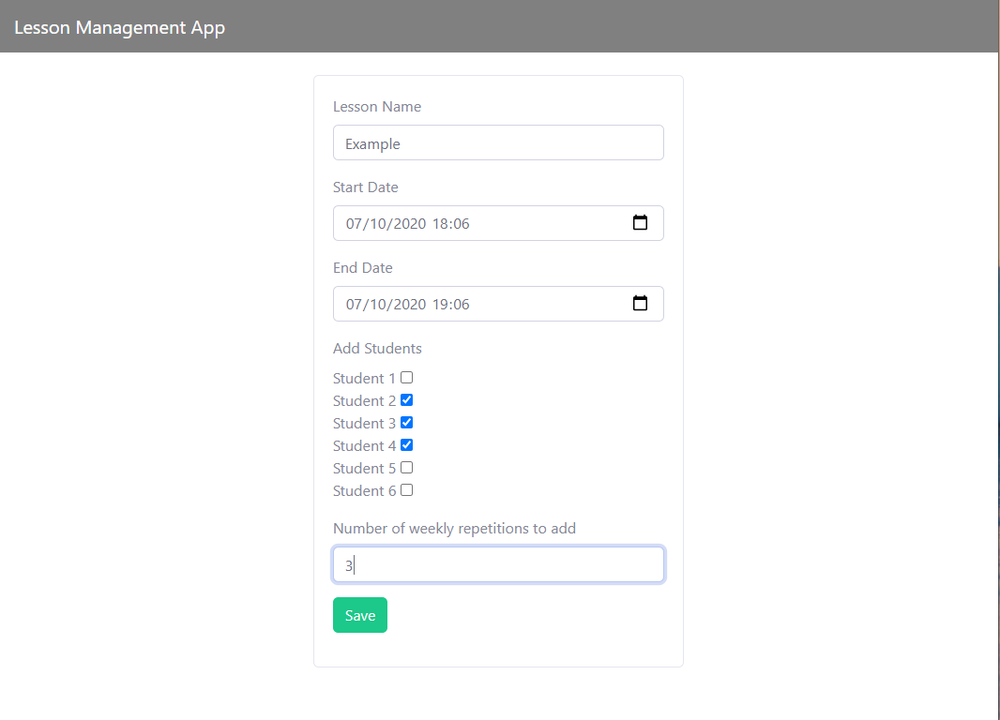
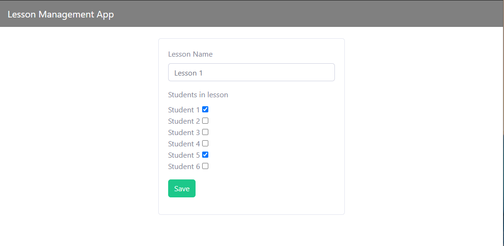
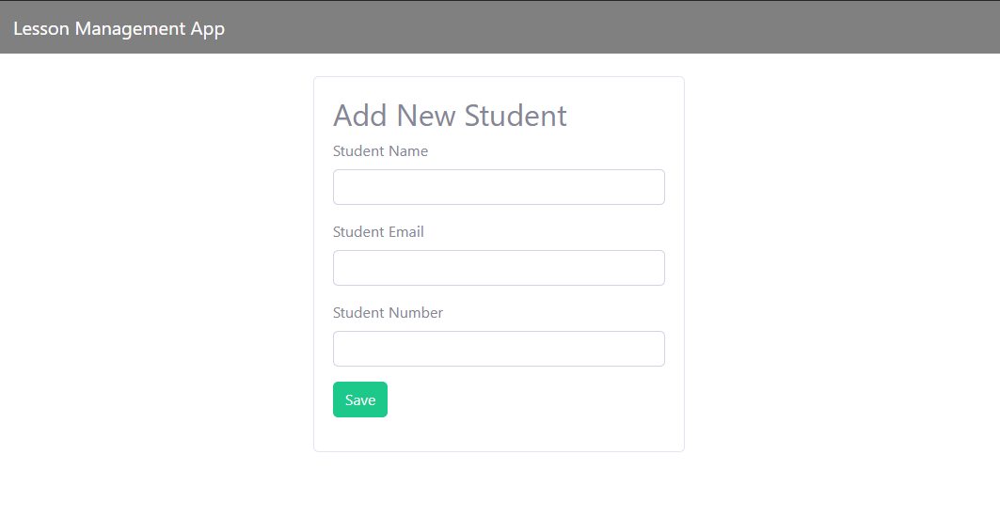
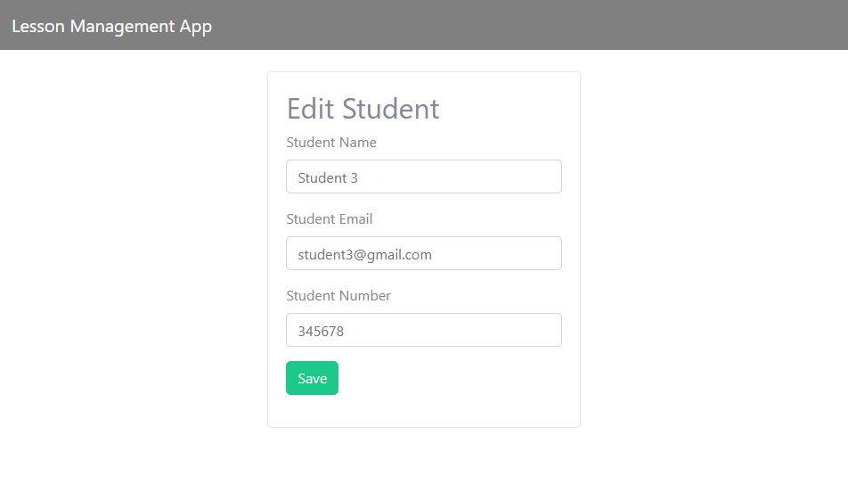

# jsp-management-application
JSP/JDBC and SQL-based web-application for small-scale teachers to schedule lessons and manage students

# Functionality
* Users can add students and their details (phone number and email address) into the database. Students in the database can then be added to new or existing lessons.
* Users can add lessons and their details (starting time, finishing time and expected students) into the database. 
* Users can edit the details of existing students and lessons.
* Users can delete students and lessons from the database.
* Users can toggle a timetable view of lessons in the database (through dhtmlx-timetable-viewer)

Homepage:

Timetable as displayed with dhtmlx-timetable-viewer:

Form to add lesson:

Form to edit a selected lesson (lesson time can be edited with dhtmlx-timetable-viewer):

Form to add a student:

Form to edit a selected student:

